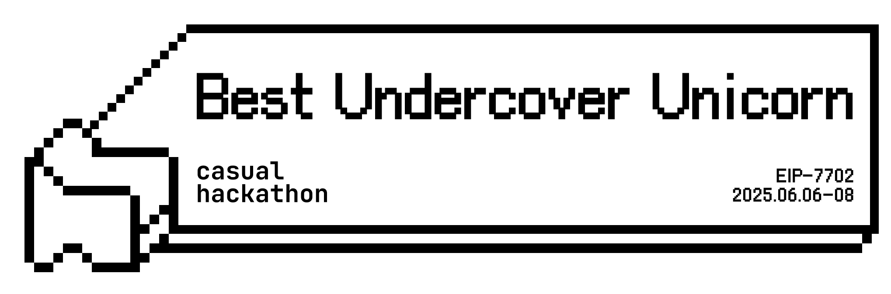

# Template Casual Hackathon

<!-- [English](./README_EN.md) | [简体中文](./README.md) -->

🧬 The Future of Template Is Calling You!

## ⏰ Event Timeline

`📍 Online` `☺️ Relaxed participation` `🙋 Open to everyone`

| Event           | Time                  | Format    | Recap                |
| --------------- | --------------------- | --------- | ------------------------------ |
| 🗓 **Open Day**  | July 11, 20:00 (UTC+8) | 📍 Online | [Play ▶️](https://example.com/) |
| 🏁 **Demo Day** | July 13, 18:00 (UTC+8) | 📍 Online |   [Play ▶️](https://example.com/)  |

## 📝 Participants

### 👤 David

`💬 Discord: david_web3#5678`  `🔧 Full-stack Developer`  `🕐 UTC+8`  
*Full-stack developer with 4 years of experience in Web3 development, specializing in React, Node.js, and smart contract integration* [🔗](./participants/David/README.md) 
##### Project: NFT Marketplace
*A decentralized NFT marketplace with advanced trading features and cross-chain compatibility* [📁](./participants/David/project/)  
<table>
<tr>
    <th align="center">🧩 Participation</th>
    <th align="center">💪 Members</th>
    <th align="center">🏁 Progress</th>
    <th align="center">🌱 Status </th>
</tr>
<tr>
    <td align="center">Solo</td>
    <td align="center">David</td>
    <td align="center">25%</td>
    <td align="center">❌ Unsubmitted</td>
</tr>
</table>

---

### 👤 Bob

`💬 Telegram: @bob_solidity`  `🔧 Solidity Developer`  `🕐 UTC+8`  
*Solidity developer with 2 years of experience in smart contract development, specializing in DeFi protocols and yield farming strategies* [🔗](./participants/Bob/README.md) 
##### Project: Yield Optimizer
*A DeFi yield optimization platform that automatically finds the best yield farming opportunities across multiple protocols* [📁](./participants/Bob/project/)  
<table>
<tr>
    <th align="center">🧩 Participation</th>
    <th align="center">💪 Members</th>
    <th align="center">🏁 Progress</th>
    <th align="center">🌱 Status </th>
    <th align="center">🏅 NFT Badge </th>
</tr>
<tr>
    <td align="center">Team</td>
    <td align="center">alice, bob</td>
    <td align="center">30%</td>
    <td align="center">❌ Unsubmitted</td>
    <td align="center"></td>
</tr>
</table>

---

### 👤 Alice

`💬 Discord: alice_web3#1234`  `🔧 Frontend Developer`  `🕐 UTC+8`  
*Frontend developer with 3 years of experience in React, Vue.js, and Web3 technologies, passionate about building user-friendly dApps* [🔗](./participants/Alice/README.md) 
##### Project: Yield Optimizer
*A DeFi yield optimization platform that automatically finds the best yield farming opportunities across multiple protocols* [📁](./participants/Alice/project/)  
<table>
<tr>
    <th align="center">🧩 Participation</th>
    <th align="center">💪 Members</th>
    <th align="center">🏁 Progress</th>
    <th align="center">🌱 Status </th>
</tr>
<tr>
    <td align="center">Solo</td>
    <td align="center">Alice</td>
    <td align="center">80%</td>
    <td align="center">✅ Submitted</td>
</tr>
</table>

---

## 🤝 Co-organizers

<table>
    <tr>
        <td  align="center" valign="middle">
            
        </td>
         <td align="center" valign="middle">
            
        </td>
        <td  align="center" valign="middle">
            
        </td>
    </tr>
</table>

## 🌐 Community Support

<table>
    <tr>
        <td align="center" valign="middle">
            
        </td>
        <td align="center" valign="middle">
            
        </td>
        <td align="center" valign="middle">
            
        </td>
        <td align="center" valign="middle">
            
        </td>
        <td align="center" valign="middle">
            
        </td>
    </tr>
</table>

_Last updated: 2025-07-18 06:34:34_
